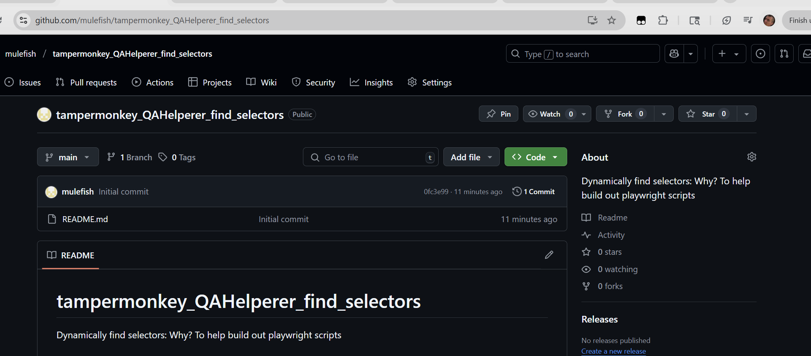

# tampermonkey_QAHelperer_find_selectors
Dynamically find selectors: Why? To help build out playwright scripts

# What does this do? 
On button pressed it will look to see what selectors it sees. Currently this is looking for 'data-testid' and 'data-test-id'. 

# NOTICE in the below screenshots
1: Top right of the screen: if this script is running, there will be a button 
2: If there is a sought for thing there will be a little box floating nearby 

# Monkeyscript is running and is toggled ON

# Monkeyscript is running and is toggled OFF 

# Monkeyscript is not running 

# Monkeyscript is being turned on

